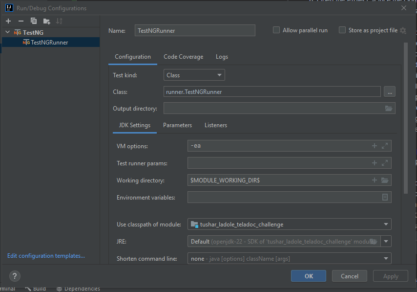
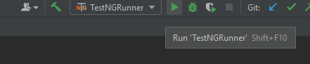
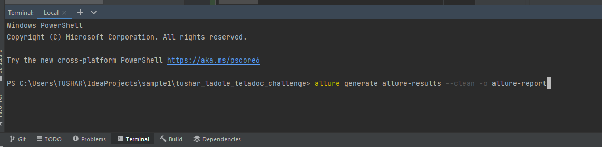
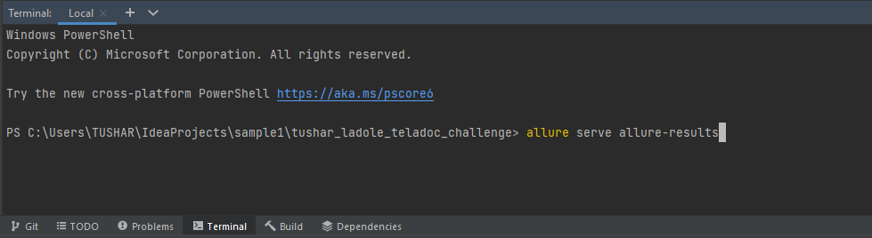

# tushar_ladole_teladoc_challenge
## Solution to the assignment

This repository contains the solution for the Teladoc challenge by Tushar Ladole. The project involves automated testing using Java, Selenium, and Allure for reporting in BDD Cucumber framework.

## Setup and Installation
To set up and run this project, ensure you have the following installed on your machine:

- Java Development Kit (JDK) 8 or higher
- Maven 3.6 or higher
- Allure Commandline
- IntelliJ

Allure plugin is needed for report generation

Follow instructions from the [Allure installation guide][allure]

# To clone a project using Version Control System (VCS) in IntelliJ IDEA, follow these steps:

Step-by-Step Guide to Clone a Project Using VCS in IntelliJ IDEA
1. Open IntelliJ IDEA:
   -Launch IntelliJ IDEA on your machine.
2. Navigate to the 'Get from Version Control' Option:
   -On the Welcome screen, click on Get from Version Control.
3. Enter Repository URL:
   -In the "Get from Version Control" dialog, enter the URL of the Git repository to clone i.e. [https://github.com/tusharladole/tushar_ladole_teladoc_challenge.git][repo]
4. Choose Directory:
   -Select the directory on your local machine where you want to clone the repository.
5. Clone the Repository:
   -Click on the Clone button. IntelliJ IDEA will start cloning the repository to your local machine.
6. Open the Project:
   -Once the cloning process is complete, IntelliJ IDEA will ask you if you want to open the project. Click Yes.
7. Configure the Project (if needed):
   -After opening the project, you might need to configure some settings such as the JDK, Maven, and other project-specific configurations.
8. Additional Configurations (if needed)
9. Set Up JDK:
   -If your project requires a specific JDK version, make sure it is configured in IntelliJ IDEA.
   -Go to File > Project Structure > Project and set the appropriate JDK.
10. Set Up Maven:
    -Ensure that Maven is correctly configured in IntelliJ IDEA.
    -Go to File > Settings > Build, Execution, Deployment > Build Tools > Maven and check the Maven home directory.
11. Install Dependencies:
    -Open the pom.xml file and click on Load Maven Changes to ensure all dependencies are downloaded and configured properly.
12. Running the Project
    -Add Run Configuration
    Click on Add Configuration
    Click on Add new configuration and Select TestNG
    
    Enter name "TestNGRunner" and Class "runner.TestNGRunner"
    Click OK
    -Run Tests:
    To run tests, select the Run configuration "TestNGRunner" and click Run.
    
13. Generate Reports:

    -Open Terminal in IntelliJ/Powershell in project location and type command "allure generate allure-results --clean -o allure-report" and hit ENTER
    
    -Type command "allure serve allure-results" and hit ENTER.
    

    -This will open the Allure HTML report in local browser.
    

[//]: # (These are reference links used in the body of this note and get stripped out when the markdown processor does its job. There is no need to format nicely because it shouldn't be seen. Thanks SO - http://stackoverflow.com/questions/4823468/store-comments-in-markdown-syntax)

[repo]: <https://github.com/tusharladole/tushar_ladole_teladoc_challenge.git>
[allure]:<https://qameta.io/blog/allure-report-hands-on/>
